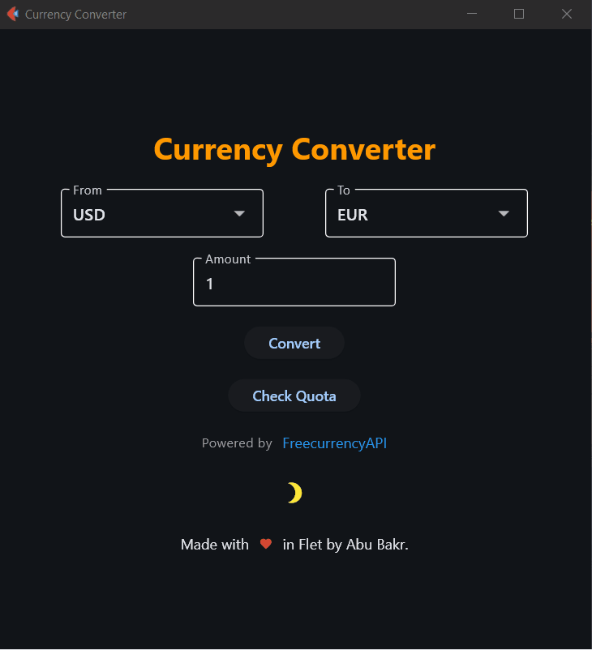

# 🌍 Currency Converter using Flet

A simple, responsive Currency Converter app built with Python and Flet! This app uses the FreecurrencyAPI to fetch live exchange rates and supports multiple currencies. Easily convert between different currencies, check the latest rates, and view API quota usage, all within a clean and intuitive interface.

## 🚀 Features

🌐 Real-time currency conversion using the `FreecurrencyAPI`.

💱 Supports multiple currencies with easy selection and conversion.

🔄 Quota usage tracking with live API status updates.

🌗 Dark/Light Mode Toggle: Switch between themes for a personalized experience.

🎨 Clean and responsive UI built with `Flet`.

⚡ Powered by `FreecurrencyAPI` and developed in Python.

## 🛠️ Tech Stack

`Python`: Backend language.

`Flet`: UI framework for building interactive web, mobile, and desktop applications in Python.

`FreecurrencyAPI`: For live exchange rates and currency data.

## 🎯 How It Works
1. Install dependencies and make sure you have Python installed, then install the required libraries:
```bash
pip install flet freecurrencyapi python-dotenv
```
2. Set up Your API Key

You will need to sign up for an API key from `FreecurrencyAPI`.

3. Create a `.env` file in the root of your project and add your API key:
```plaintext
API_KEY='your_freecurrencyapi_key'
```
3. Run the app once you've set up your environment using:
```bash
python main.py
```
The app will open in a new desktop window.

## 🖥️ App UI
The app interface is simple and user-friendly:

Select the `From` and `To` currencies from the dropdown.

Enter the Amount to be converted in the `TextField`.

Click the `Convert` button to get the result instantly!

You can also check your API Quota using the `Check Quota` button.

## 🌗 Theme Toggle
We’ve added a Light/Dark Mode Toggle for a customizable experience. You can switch between light mode 🌞 and dark mode 🌙 by clicking the moon/sun icon in the app.

Light Mode: Uses a light blue background.

Dark Mode: Uses a black background.

## 📷 Screenshots


## 🔧 Code Overview
The app uses Flet for UI components and `FreecurrencyAPI` to fetch live exchange rates. 

Key functions include:

`fetch_currencies()`: Fetches available currencies from the API and populates the dropdowns.

`convert_currency()`: Converts the entered amount based on the selected currencies and shows the result.

`check_quota()`: Displays the current quota usage for the `FreecurrencyAPI`.

## 📚 References

[Flet Documentation](https://flet.dev/docs/)

[FreecurrencyAPI Documentation](https://freecurrencyapi.com/docs/)

## 👨‍💻 Author

Built with 💖 by Abu Bakr using Flet and FreecurrencyAPI.

## 🎉 Contribution

Feel free to open a pull request or report issues if you would like to contribute!