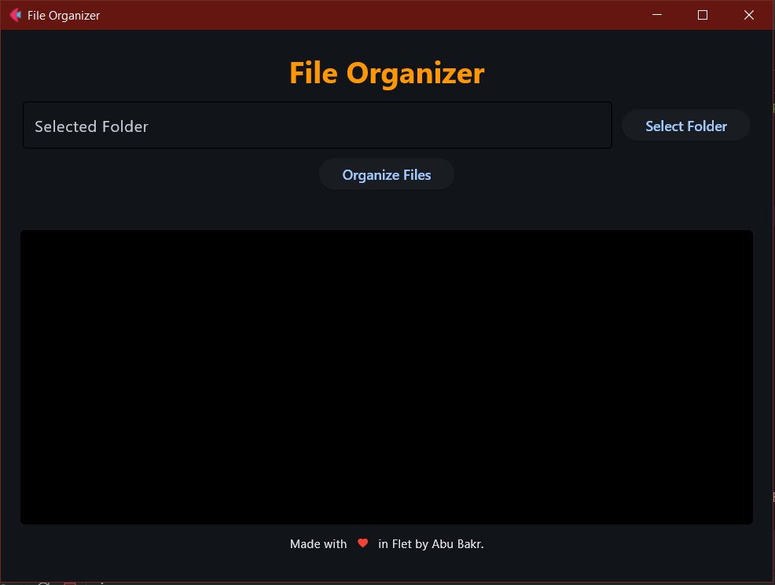
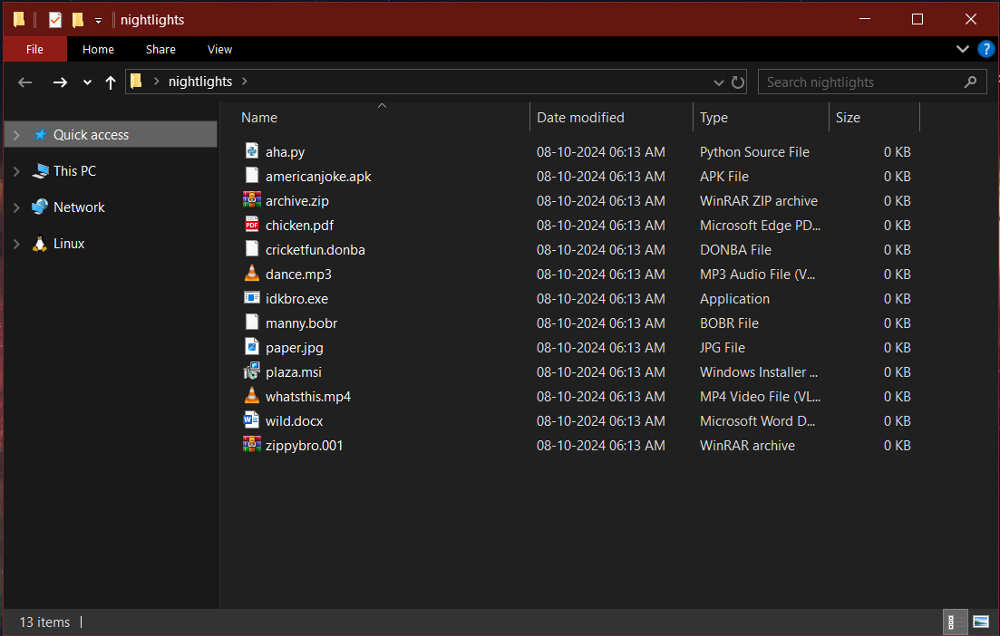
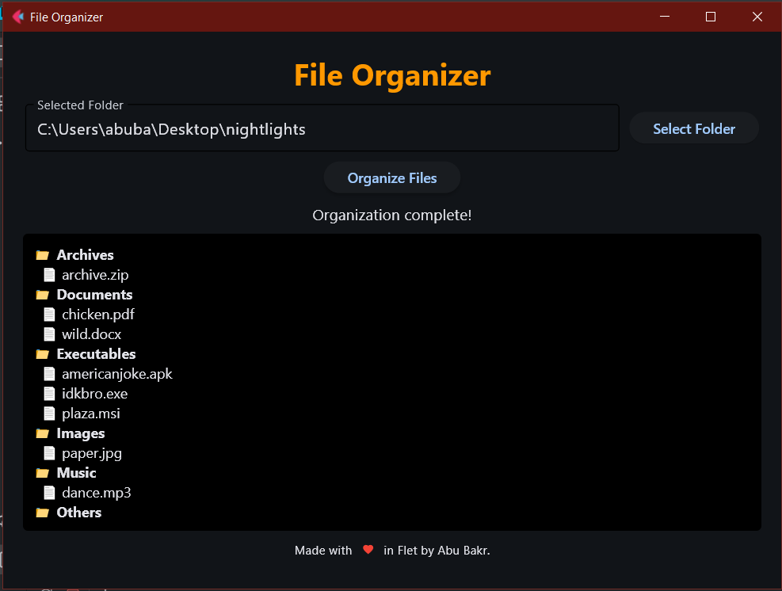
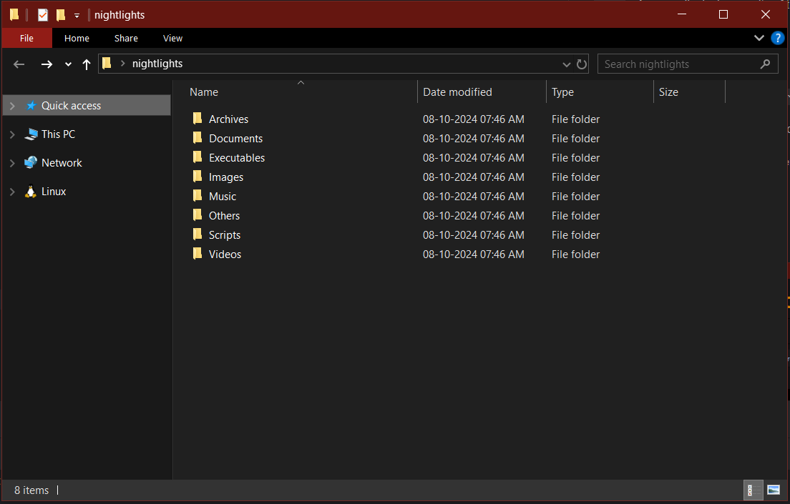

# File Organizer

A simple program designed using Flet in Python to get organize files into folders!

## Usage/Examples

1. Clone the package or download.
2. Run using `python .\main.py` on your terminal in ``cwd``.

## Interface
`Text`: Area to display the selected folder (not editable)

`Select Folder`: Button to choose your desired folder.

`Organize Files`: Button to organize your files present in the chosen folder.

## Limitations
Currently, only contains predefined extensions for file names.

## Screenshots
Application

Unsorted folder

Organized (with scrollable view)!

## Warning
Do not use this application to try with important files or documents. Files maybe modified or lost during operation as it is not tested.
Please use it only for development purposes since more features may be added or removed.

## Disclaimer
The author of this repo is not responsible for any loss or modification of your files.
