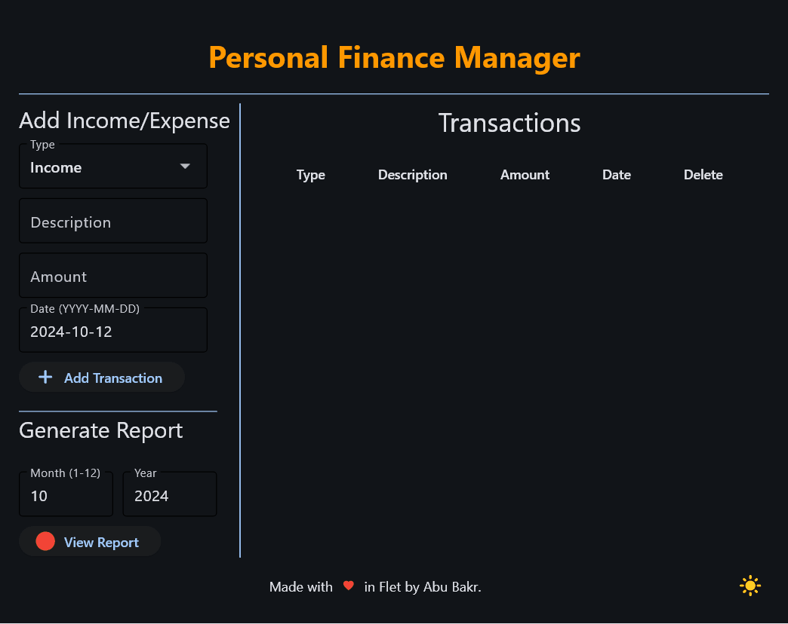
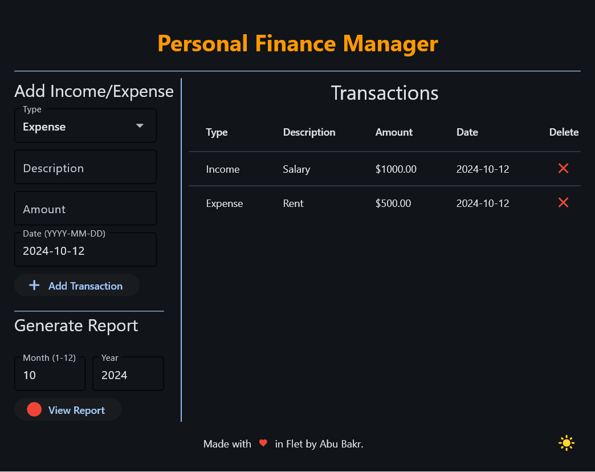
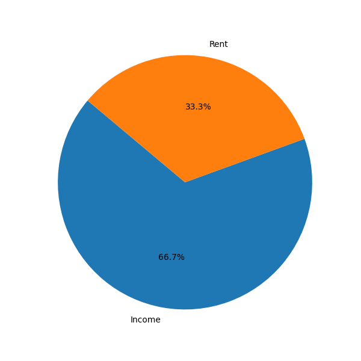

# Personal Finance Manager 🧾💰

A Personal Finance Manager built using Python and Flet 🐍. Track your income and expenses, generate reports with pie charts 📊, and export them as PDFs! Whether you're saving for something special or just trying to stay organized, this app makes it simple and effective.

## 🚀 Features

`Add Transactions`: Record both income and expenses in just a few clicks!

`Dynamic Pie Charts`: Get a visual breakdown of your expenses with a pie chart 🎨.

`Transaction Filtering`: Filter your transactions by month and year for easy reporting.

`PDF Reports`: Generate financial reports and save them as PDF files 🗂️.

`Dark/Light Mode Toggle`: Easily switch between dark and light themes 🌙☀️.

`Data at a Glance`: Keep an eye on your income, expenses, and balance in one place 💼.

## 🛠️ Built With

Flet - Used for building the app's frontend and interactions.

Matplotlib - Powers the pie charts for visualizing expense categories.

ReportLab - Generates beautifully formatted PDF reports.

## 📸 Screenshots
### ▶️ Working


### 🌙 Switch Day/Night mode!


## 📊 Pie Chart Report


## Report generated
[10-2024.pdf](10-2024.pdf)


## 📦 Getting Started
To get a local copy up and running, follow these steps:

### Prerequisites
Ensure you have Python 3.12 installed and set up the required packages:

```bash
pip install flet matplotlib reportlab
```
### Installation

#### Clone the repo:

```bash
git clone https://github.com/knightlesssword/flet.git
```
#### Change to project directory from Terminal

```cmd
cd FinanceManager
```

#### Run the app:

```bash
python main.py
```
## 🧑‍💻 Usage

`Add Transactions`: Enter the type (Income/Expense), description, amount, and date. Hit "Add Transaction" to save it.

`Remove Transaction`: Delete an unwanted transaction by pressing the `❌` icon.

`Generate Reports`: Choose a month and year, and click "Generate Report" to generate a summary with a pie chart and statistics.

`Save Report`: Save the report as a PDF file from `Generate Report` to keep a record of your financial performance.


## 🙏 Acknowledgements
[`Flet Framework`](https://flet.dev/) – For building an easy and beautiful Python UI.

[`Matplotlib`](https://matplotlib.org/) – For powering the charts.

[`ReportLab`](https://www.reportlab.com/) – For the robust PDF generation.

## ⚠️ Disclaimer

**Personal Finance Manager** is designed to help users track their personal income and expenses. However use it for development purposes and please note the following:

1. **No Financial Advice**: This app is not intended to provide financial advice. The data and reports generated are based solely on the information you input. Always consult a professional financial advisor before making financial decisions.


2. **Risk of Data Loss**: While the app provides a method to store and view your financial transactions, I am not responsible for any data loss. It is recommended that users regularly back up their data to prevent any unintended loss.


3. **Liability**: The creator of this app cannot be held responsible for any financial loss, damages, or issues resulting from the use of this app. Use it at your own risk. The app is provided "as is" without any warranties, either express or implied.


4. **Security of Your Data**: Although every effort is made to ensure that your data is handled securely, it is up to the user to ensure that the environment in which they use this app is secure. We recommend avoiding using this app on unsecured or public devices.

## ✨ Author

[Abu Bakr](https://github.com/knightlesssword/)

Happy coding! 👨‍💼👩‍💼
