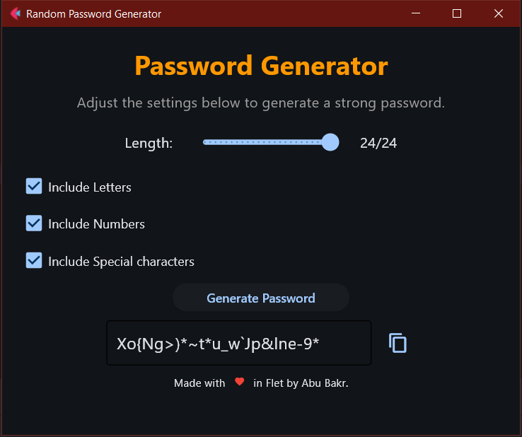

# 🔒 Random Password Generator 🔑

Welcome to Random Password Generator built using Flet with 🐍 Python! This application allows you to generate secure, customizable passwords with a combination of letters, numbers, and special characters.

## 🚀 Features

🎛 Customizable Length: Set password length from 1 to 24 characters with a simple slider.

🔤 Character Options: Choose to include letters, numbers, and/or special characters with checkboxes.

📝 Password Display: Generated password appears in a text field ready to be copied.

✂️ One-Click Copy: Easily copy your password to the clipboard with a single click.

⚠️ Validation: Ensures that at least one character type is selected before generating a password.

## 🛠️ How to Run
Clone the repository:

```bash
git clone https://github.com/knightlesssword/flet.git
```
Navigate to the project directory:

```bash
cd RandomPassword
```
### Install dependencies:

Make sure to have Flet installed.

```bash
pip install flet
```
Run the application:

```bash
python password_generator.py
```

## 📸 Screenshots


## 👨‍💻 Author
Made with ❤️ by Abu Bakr using Flet.

## ⚠️ Disclaimer
This tool is designed for personal use and educational purposes only. While it generates strong passwords, it is not intended for use in highly sensitive or mission-critical systems. Always follow best security practices when managing and storing your passwords. The author is not responsible for any security risks or data breaches arising from the use of this tool.
