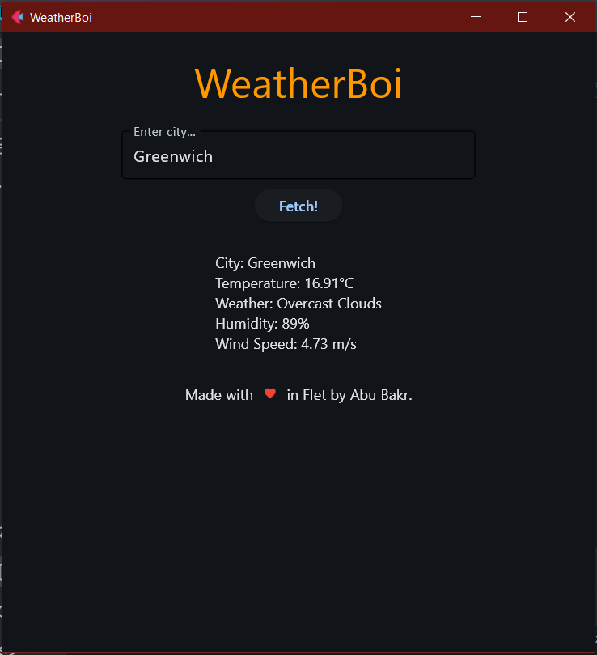

# WeatherBoi

A simple program designed using Flet in Python to get current weather information!

## Usage/Examples

1. Clone the package or download.
2. Run using `python .\main.py` on your terminal in ``cwd``.

## Interface

`TextField` - An editable field to enter `city` name.

`Fetch` - Fetch the current weather data for given city.

`Text` - An area displaying results of the weather information.

## API
Website: `https://openweathermap.org/api`

Provides upto 1000 free API calls per day.

Add API key to `.env` file after registering for a free account.

## Screenshots
