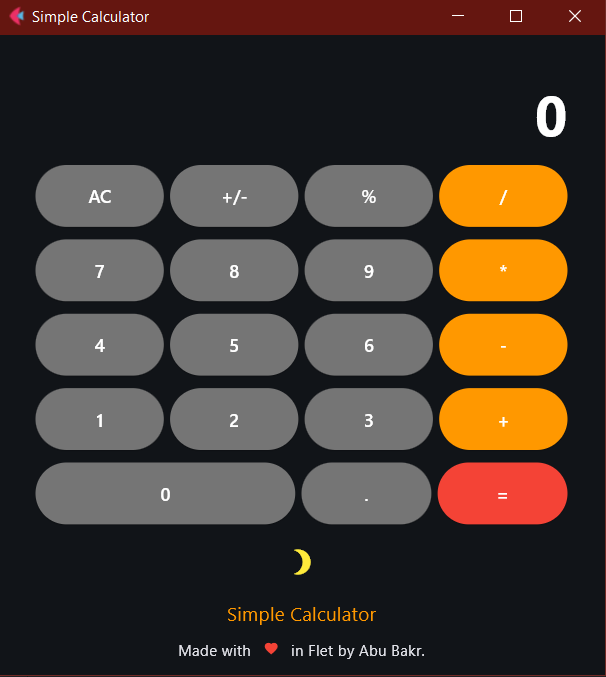

# Simple Calculator

A simple calculator designed using Flet in Python!

## Usage/Examples

1. Clone the package or download.
2. Run using `python .\main.py` on your terminal in ``cwd``.

## Interface

`Buttons` - Numerical values to use for calculations using `Buttons`.

`Result` - Displays value in `TextField`.

`Dark/Light` - Switch between Dark mode and Light Mode!.

## Screenshots
